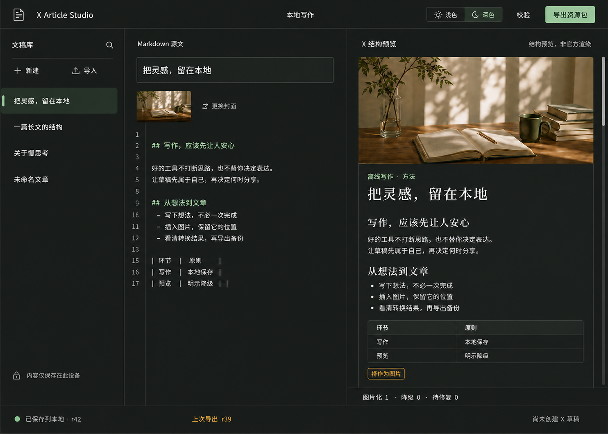

<div align="center">

# ACKS X Article Editor

**让稿件先属于自己，再决定何时分享。**

离线优先的 Markdown 长文写作台 · X 结构预览 · 可恢复资源包


[在线预览](https://xeditor.acks.com.cn) · [功能范围](#功能范围) · [使用指南](#使用指南) · [本地开发](#本地开发) · [Docker 部署](#docker-部署) · [AI Agent 自部署提示词](docs/SELF_HOSTING_AGENT_PROMPT.md) · [数据与安全](#数据与安全)

</div>

ACKS X Article Editor 将写作、格式转换与远端发布分开。你在浏览器中编辑 Markdown；预览读取转换后的目标结构；表格和代码按明确规则生成图片；源文、图片和校验信息可一起导出，在其他浏览器中恢复。

> **当前版本：0.2.0 私有预览版。** 已加入完整 SVG Markdown 工具栏、顺序列表输入规则、手动发布引导，以及基于 X 官方 OAuth 2.0 PKCE、媒体上传与 Articles API 的受控发布桥。2026-09-01 已由维护者真实验证 OAuth、图片与表格上传、Article 草稿和正式发布。官方体验站使用邀请码账号；自部署使用部署者自己的域名、Client ID 与 X API 余额。详细证据与限制见 [验收记录](docs/ACCEPTANCE.md)。

## 设计基线

采用纸感双栏写作界面，支持浅色与深色主题。左侧管理文稿，中间编辑 Markdown，右侧查看 X 兼容结构。底栏分别显示本地保存、文件导出与 X 草稿状态。

下图是**经确认的设计参考，不是已通过验收的运行截图**：


<details><summary>查看深色设计参考</summary>



</details>

## 功能范围

| 能力       | 当前实现                                                                                                     |
| ---------- | ------------------------------------------------------------------------------------------------------------ |
| 写作       | CodeMirror Markdown 编辑、纯 SVG 工具栏、H1–H6、行内样式、列表、引用、表格、代码、链接、图片、脚注与扩展语法 |
| 文稿管理   | 新建、副本、归档、可恢复回收站；不自动永久删除文稿                                                           |
| 持久化     | IndexedDB 事务、自动保存、本地版本历史、过期写入冲突保护                                                     |
| 图片       | PNG / JPEG / 静态 WebP，文件选择、粘贴、拖入、缺图关联                                                       |
| 格式转换   | 标题、段落、粗体/斜体/删除线、列表、引用、链接、图片、分割线、嵌帖占位                                       |
| 图片化     | 表格与围栏代码生成 2x PNG，长内容分片，保留源码                                                              |
| 校验       | 协议白名单、缺失资源、降级报告、源位置定位、转换 JSON                                                        |
| 迁移       | ZIP 资源包、SHA-256 清单、哈希校验、导入为新文稿                                                             |
| 离线       | 首次完整加载后缓存应用资源；更新需用户确认                                                                   |
| 主题       | 浅色/深色，记住选择；不改变原图或已生成的图片                                                                |
| X 手动发布 | 打开 X Articles、分别复制标题/正文、逐张复制或下载图片                                                       |
| X 直接发布 | OAuth 2.0 PKCE、X 媒体上传、创建 Article 草稿、二次确认公开发布                                              |
| 体验账号   | 官方体验站使用一次性邀请码；普通账号一次直发，管理员不限次数                                                 |

**边界：** 首次从网站访问需要网络。不同浏览器、设备、域名之间不自动同步。`file://` 双击源码不是受支持的运行方式。Mermaid 当前保留源码并按代码出图，不承诺图形渲染。行内代码与深层标题等会按规则降级并提示。

## 技术栈

| 层       | 选型                                           | 作用                                           |
| -------- | ---------------------------------------------- | ---------------------------------------------- |
| 应用     | React 19、TypeScript 7、Vite 8                 | 静态前端与类型检查                             |
| 编辑     | CodeMirror 6                                   | 输入事务、选择区、历史与 Markdown 语法         |
| 数据     | Dexie 4 / IndexedDB                            | 文稿、Blob 与快照；revision 冲突检查           |
| 转换     | unified / remark-parse / remark-gfm            | Markdown AST 与自有目标模型                    |
| 校验     | Ajv 8 / JSON Schema                            | 文档结构；X DTO 与内部模型分离                 |
| 图像     | Canvas 2D / Shiki 4                            | 表格排版、代码高亮及 PNG 分片                  |
| 包格式   | fflate / Web Crypto                            | ZIP、SHA-256 与完整性校验                      |
| 后台任务 | Web Workers                                    | Markdown 转换与导入包检查                      |
| 视觉     | CSS Variables / Phosphor Icons / Noto Serif SC | 双主题和本地字体                               |
| 测试     | Vitest / fake-indexeddb / 生产 Worker 回归脚本 | 转换、持久化、安全边界                         |
| 发布桥   | Node.js 24 / SQLite / AES-256-GCM              | 同源 OAuth 会话、令牌加密、媒体与 Article 请求 |
| 运行     | 非特权 Nginx / Docker / Caddy HTTPS            | 静态应用与发布桥分容器、仅 loopback 暴露       |

依赖具体版本由 `pnpm-lock.yaml` 固定。服务器部署模式不需要数据库容器，也不需要 X 或 OpenAI API Key。

## 使用指南

### 新建与编辑

打开站点后，示例文稿会帮助你了解界面。点击“新建”，输入标题和 Markdown。通过“正文图”插入图片，也可以把图片文件粘贴或拖入编辑区。图片会先预留正文位置，再异步处理。

写作时观察底栏：只有 IndexedDB 事务提交成功才显示“已保存到本地”。“未保存”或“保存失败”不等于安全备份；遇到失败，优先导出恢复包，不要清除站点数据。

### 导入 Markdown 与图片

点击“导入”，选择一个 `.md` 文件，可同时选择它引用的图片。首个 H1 会提取为标题。浏览器不会因选中了 Markdown 就获得读取同目录其他文件的权限；缺图会保留占位，可在“资源管理”中逐项关联。

远程图片链接不会自动访问或下载。若需要完整离线文稿，请提供本地图片。应用不会执行 Markdown 中的 HTML 或脚本。

### 查看预览与问题

右侧显示转换后的结构，明确标注“结构预览，非官方渲染”。点击“校验”查看图片化、降级及缺图问题；点击问题定位源文。界面中的 X 帖子卡片只是离线占位，只有主动点击外链才访问 X。

表格、代码会以图片发布方向预览。图片化会损失复制与语义能力，因此资源包保留完整源码。界面主题不会反相原图，也不会改变派生图片字节。

### 手动复制到 X Article

1. 在预览上方点击“复制标题”，粘贴到 X 编辑器顶部的标题栏。
2. 点击“复制正文”，粘贴到 X 正文区。复制结果包含标题层级、列表、行内格式和安全链接，不含应用界面文案、文章标题、封面或图片数据。
3. 正文中的 `[图片 1：表格，请单独插入]` 是定位提示。回到本站对应图片下方点击“复制图片”，再到 X 的对应位置粘贴。如果 X 没有接受图片粘贴，点击“下载 PNG”，使用 X 的图片上传入口插入。
4. 多张图片或长表/代码分片须逐张处理，插入后删除对应位置提示。嵌帖按 URL 复制，请在 X 核对是否被正确识别。
5. 人工检查后再在 X 发布。本应用不会替你发布。

预览图像使用本站私有的 Blob URL。整段选择复制不能可靠地将其变成 X 上已上传的媒体；专用图片按钮写入的是 `image/png` 数据。按钮显示“已复制”只表示剪贴板写入成功，不表示 X 已接收或文章已发布。

当前浏览器不支持富文本时会明确提示“纯文本”，不支持图片复制时会提示使用下载。资源包仍是备份文件，不是 X 的导入文件。

### 直接创建 X 草稿与发布

点击“直接发布到 X”，输入 X Developer Portal 中 OAuth 2.0 Public Client / SPA 的 Client ID，并把界面显示的回调地址原样加入应用设置。浏览器会跳转到 X 授权；返回后，应用可把本地图片、表格和代码图片上传为 X media，再创建 Article 草稿。

创建草稿不会公开内容。公开发布必须在同一对话框中输入“发布”并再次确认；服务端会核对会话、草稿 ID 和冻结请求哈希。外链图床图片在 X Article 结构中只能作为链接，不能替代原生 media ID，因此本项目不提供会产生错误预期的“图床直传 X”设置。完整设置、安全边界和故障定位见 [X 发布桥指南](docs/X_PUBLISHING.md)。

官方体验站使用邀请码账号。未登录仍可使用全部本地写作、备份和手动发布能力；直接发布需要登录。普通体验账号在 X 成功返回草稿 ID 时消耗一次额度，仍可继续发布该草稿；管理员不限次数。账号只控制发布权限，稿件与图片不会因为登录而同步到服务器。

### 导出与恢复

“导出资源包”包含：

```text
article.xas.zip
├── manifest.json        # 版本、文件路径、大小与 SHA-256
├── article.json         # 完整恢复真源
├── article.md           # 可供其他编辑器使用的 Markdown
├── conversion.json     # 本地目标结构，不是已就绪的 X 请求
├── validation.json     # 校验与恢复说明
└── assets/
    ├── original/        # 正文引用的原图与封面
    └── derived/         # 表格与代码 PNG
```

导出固定一份文稿版本；生成过程中继续编辑不会混进这一包。普通浏览器只能确认已触发下载，**请检查实际文件**。在另一浏览器点击“导入”并选择 ZIP 即可恢复；已有同 ID 文稿不会被覆盖。

“仅 Markdown”不包含图片文件，不是完整备份。“恢复包”用于抢救缺图或出图失败的稿件，可能不完整；请解压后导入 Markdown 并修复资源。

### 历史、冲突和存储

通过编辑区右上角历史按钮查看版本。恢复会创建新 revision，原有历史仍保留。近 24 小时保留细粒度历史，较旧记录按 5 分钟间隔保留 30 天；手动和导入快照保留。

另一标签页写入新版本时，本页不会悄悄覆盖它。若存在本地未保存修改，使用“另存副本”保留两个版本。在“关于与本地存储”中查看离线资源、空间估计及持久化权限。

## 本地开发

需要 Node.js 24 LTS 和 pnpm 11.19.0。开发者安装依赖需要网络；终端用户访问部署站点不需要安装这些工具。

```bash
git clone https://github.com/shynloc/ACKS-X-Article-Editor.git
cd ACKS-X-Article-Editor
corepack enable
corepack prepare pnpm@11.19.0 --activate
pnpm install --frozen-lockfile
pnpm dev
```

通过 `http://127.0.0.1:47631/` 访问。不要直接打开项目中的 `index.html`。端口被占用时应用不会静默换端口，因为端口变化意味着不同浏览器存储空间。

```bash
pnpm typecheck
pnpm test
pnpm build
node scripts/test-built-worker.mjs
pnpm test:sites
```

生产静态文件在 `dist/client/`。模板保留了可选 Sites 打包元数据，但当前项目的部署目标是 Docker / Caddy，不需要 Sites 账号。

## Docker 部署

### 常规构建

```bash
cp .env.example .env
# 将 PUBLIC_BASE_URL 改为自己的 HTTPS 域名，并生成独立 X_SESSION_SECRET
docker compose build
docker compose up -d
curl http://127.0.0.1:5701/health.json
```

容器使用非特权 Nginx、只读根文件系统、临时 `/tmp`、资源上限和日志轮转。发布桥使用独立 Node 容器和持久 SQLite 卷；宿主机仅绑定 `127.0.0.1:5701`，不要把应用或发布桥端口公开到互联网。

自部署必须保持 `DEPLOYMENT_MODE=selfhost`。该模式不启用官方体验站的邀请码和一次直发限制，部署者使用自己的 X Developer Client ID、API 余额与回调地址。不要把官方体验站的域名、Client ID、Cookie、token 或 SQLite 卷复制到自部署实例。

如果由 AI Agent 执行部署，请把 [AI Agent 自部署提示词](docs/SELF_HOSTING_AGENT_PROMPT.md) 整段交给 Agent，并补充 SSH 目标、域名和期望 loopback 端口。提示词包含只读审计、候选发布、X Developer 配置、验收和回滚要求。

如果 Docker 构建网络无法连接包仓库，可先在受控构建机完成锁文件安装、测试和构建，再制作运行层镜像：

```bash
pnpm install --frozen-lockfile
pnpm check
node scripts/test-built-worker.mjs
docker build -f Dockerfile.runtime -t acks-x-article-editor:release-id .
EDITOR_IMAGE=acks-x-article-editor:release-id docker compose up -d --no-build
```

这条路径复制已验证的静态构建产物，不在容器启动时联网安装包。部署前记录源码 commit 和 `/health.json` 的 build 标识。

### HTTPS 与反向代理

生产应使用 HTTPS，以支持安全上下文与 Service Worker。下面配置作为**独立站点**加入现有 Caddy，不能覆盖其他站点：

```caddyfile
xeditor.acks.com.cn {
    encode zstd gzip
    reverse_proxy 127.0.0.1:5701
}
```

域名解析到目标服务器，允许 80/443 到达 Caddy。修改后先 `caddy validate`，再 reload。详细服务器发行、备份、检查与回滚流程见 [部署指南](docs/DEPLOYMENT.md)。

## 数据与安全

- 文稿、原图与历史保存在当前浏览器 IndexedDB。只有用户主动创建 X 草稿时，冻结后的转换结构和图片才通过同源发布桥发送到 X。
- 不包含统计 SDK、第三方字体请求、远程图片预取或嵌帖脚本。字体与高亮资源随构建提供。
- 导出包包含私人原稿与可能带 EXIF 的原图，分享前请检查。不要提交真实用户包到 Git。
- ZIP 导入检查路径、体积、压缩比、重复条目与哈希，校验放在隔离 Worker 中并设置超时。
- 图片在解码前读取尺寸，拒绝超大像素、动画和不支持格式；不执行 SVG。
- 浏览器主动清理、隐私模式与磁盘故障可能使本地数据丢失。**本地保存不能代替外部备份。**
- Client ID 不是秘密；项目不要求 Client Secret。OAuth token 由服务端使用 AES-256-GCM 加密后保存在 SQLite，浏览器只持有 HttpOnly、SameSite 会话 Cookie。
- 发布桥检查同源、CSRF、媒体类型与大小；日志不记录 token 或文章正文。生产必须提供独立随机 `X_SESSION_SECRET`。
- 官方体验站的密码使用 scrypt 强哈希；邀请码只保存 SHA-256 摘要并且只能使用一次。普通账号额度在草稿创建成功后原子扣除。
- `DEPLOYMENT_MODE=hosted` 只用于维护者运营的体验站；自部署保持 `selfhost`，不应依赖维护者的 X API 配额。

安全问题不要在公开 Issue 中附真实稿件、凭证或敏感日志；使用项目维护者认可的私密渠道沟通。

## 开发路线

| 阶段 | 范围                                         | 状态                                |
| ---- | -------------------------------------------- | ----------------------------------- |
| V1.0 | 写作、转换、保存恢复、资源包与离线缓存       | 实现与验收中                        |
| V1.1 | 完整 Markdown 工具栏、列表输入、手动发布引导 | 已在 0.2.0 实施                     |
| V2.0 | OAuth、媒体上传、真实 X 草稿桥               | 已实现并通过真实账号联调            |
| V2.1 | 绑定账号/草稿/请求哈希的发布确认             | 已实现并完成真实公开发布验收        |
| V3   | MCP、模板、队列与有条件回读                  | 未实施                              |

版本规划见 [PRD](docs/PRD.md)，实际范围变化见 [部署形态决策](docs/decisions/001-server-hosted.md)。

## 项目结构

```text
src/components/     编辑器、预览与异常边界
src/core/           文档类型、Markdown 转换、校验与 Worker
src/services/       IndexedDB、出图、资源包和离线更新
schemas/            固定的外部接口契约
tests/              转换、存储、资源包与安全测试
deploy/             Nginx 与 Caddy 示例
docs/               PRD、部署、验收与设计参考
```

本项目尚未宣告正式可用或开源发行；仓库在完整验收前保持私有。公开前需完成验收、源码/历史敏感信息检查并确认许可证。第三方组件按各自许可证使用，见 [第三方声明](docs/THIRD_PARTY.md)。
