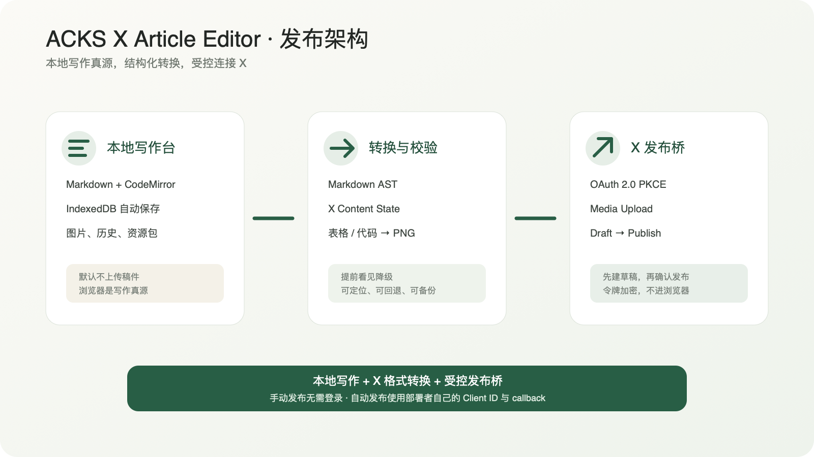

<div align="center">

# ACKS X Article Editor

[中文](README.md) · [English](README_EN.md)

**Keep the draft yours. Decide when to share it.**

A local-first Markdown workstation for X Articles · structure-aware conversion · manual and controlled publishing

[](https://github.com/shynloc/ACKS-X-Article-Editor/actions/workflows/ci.yml)


[Live demo](https://xeditor.acks.com.cn) · [Quick start](#quick-start) · [Self-hosting](#docker-self-hosting) · [X Developer setup](#x-developer-setup) · [AI Agent deployment prompt](docs/SELF_HOSTING_AGENT_PROMPT.md) · [Documentation](#documentation)

</div>


ACKS X Article Editor is built for writers who use Markdown but publish long-form work through X Articles. It separates **local writing, X-compatible conversion, and remote publishing** into explicit stages. Drafts and original images stay in the browser by default. The converter shows image rendering, style degradation, and missing assets before publishing. Writers can then use a manual copy workflow or connect their own X Developer Client ID to create and publish a draft.

> **Current release: 0.2.0 · Public Preview**<br>
> On September 1, 2026, the complete OAuth, body image, table image, Article draft, and publish workflow was verified against a real X account. The repository is public. Self-hosted deployments have no trial publishing limit; the hosted demo uses invite accounts for controlled automatic-publishing access.

## Why this project exists

The built-in X Article editor is a conventional rich-text editor. For writers with an established Markdown or HTML workflow, pasting a long article often means repairing headings, lists, tables, code blocks, and images by hand.

This project does not clone the official editor. It follows a different model:

> **Local writing desk + X format conversion + controlled publishing bridge**

- Markdown remains a portable source of truth.
- X compatibility issues are visible before content leaves the browser.
- Tables and fenced code blocks can be rendered locally as crisp PNG images.
- Automatic publishing creates a draft first and requires a separate final confirmation.
- If the platform is unavailable, the Markdown source, images, and recovery archive remain under your control.

The project introduction is included as the default editor template: [view the Markdown source](docs/INTRO_ARTICLE.md). It intentionally uses headings, blockquotes, emphasis, strikethrough, task lists, tables, code blocks, images, links, and footnotes as a real conversion sample.

## Features

| Area                  | Current capability                                                                                                                                |
| --------------------- | ------------------------------------------------------------------------------------------------------------------------------------------------- |
| Markdown editing      | CodeMirror 6, H1–H6, bold, italic, strikethrough, blockquotes, lists, task lists, tables, code, links, images, footnotes, math, and Mermaid input |
| List input            | Enter continues the list; ordered lists write real incrementing numbers into the source; Enter on an empty item exits the list                    |
| Local persistence     | IndexedDB transactions, autosave, version snapshots, and revision conflict protection across tabs                                                 |
| Images                | PNG, JPEG, and static WebP; file picker, paste, drag and drop, and missing-file reassociation                                                     |
| X conversion          | Markdown AST to X Content State for headings, inline styles, lists, quotes, links, images, and dividers                                           |
| Image rendering       | Tables and fenced code rendered locally as 2x PNG; long content is split while the original Markdown is preserved                                 |
| Validation            | Safe URL protocols, missing assets, degradation reports, source-range navigation, and conversion JSON                                             |
| Backup and migration  | ZIP archive, SHA-256 manifest, integrity verification, and import into another browser                                                            |
| Manual publishing     | Separate title, rich body, and individual PNG copy actions; no account required                                                                   |
| Direct publishing     | OAuth 2.0 PKCE, X Media Upload, Article Draft, and a separate final publish confirmation                                                          |
| Offline use           | Application shell cached after the first full load; updates require confirmation; `/api/` always bypasses the Service Worker                      |
| Hosted trial accounts | Invite registration, scrypt password hashing, one direct workflow for trial users, unlimited workflows for administrators                         |

## Two publishing workflows

### Manual publishing

Manual publishing requires no site account and shares no OAuth token with the hosted service:

1. Open **Manual publish to X**.
2. Copy the title and body separately.
3. Copy or download tables, code blocks, and local images one at a time.
4. Review the result in the X Article editor and publish it yourself.

The exported resource archive is a backup format, not an X import format. Image positions remain visible as explicit placeholders in the copied body.

### Create and publish a draft through the API

Direct publishing uses the deployer's or writer's own X Developer Client ID:

1. Connect an X account with OAuth 2.0 PKCE.
2. Upload the cover, body images, rendered tables, and rendered code.
3. Create an X Article draft.
4. Review the draft on X.
5. Type the explicit publish confirmation and publish.

The application does not ask for a Client Secret, Bearer Token, OAuth 1.0 Consumer Secret, or manually generated Access Token. OAuth tokens are encrypted inside the publishing bridge. The browser receives only an HttpOnly session cookie.

## Live demo

Open [https://xeditor.acks.com.cn](https://xeditor.acks.com.cn).

| Access mode          | Capability                                                                 |
| -------------------- | -------------------------------------------------------------------------- |
| No login             | Local writing, preview, validation, import/export, and manual publishing   |
| Trial invite account | One complete direct-publishing workflow using the writer's own Client ID   |
| Administrator        | Unlimited direct publishing, invite generation, and trial quota management |

Signing in controls direct-publishing permission only. **It does not upload or synchronize local drafts.** You can use the writing and manual-publishing workflow without ever signing in.

## Architecture



```text
Browser
├── React + CodeMirror
├── IndexedDB: drafts, image blobs, version history
├── Markdown AST: conversion, validation, degradation report
├── Canvas + Shiki: table and code PNG rendering
└── ZIP + SHA-256: archive and recovery
       │
       │ /api/x/ · same origin
       ▼
Node Publish Bridge
├── OAuth 2.0 PKCE
├── AES-256-GCM token encryption
├── SQLite: sessions, invites, quotas, remote draft records
└── X Media → Article Draft → Publish
```

The production topology uses two containers:

- **editor**: unprivileged Nginx serving the static application and proxying `/api/x/`;
- **bridge**: Node.js publishing service reachable only on the internal Compose network, with no public port mapping.

The article library lives in browser IndexedDB. Server-side SQLite does not store the draft library; it stores account permissions, encrypted OAuth sessions, and remote draft records.

## Technology

| Layer             | Technology                                                                                         |
| ----------------- | -------------------------------------------------------------------------------------------------- |
| Application       | React 19, TypeScript 7, Vite 8                                                                     |
| Editor            | CodeMirror 6                                                                                       |
| Local data        | Dexie 4, IndexedDB                                                                                 |
| Markdown          | unified, remark-parse, remark-gfm                                                                  |
| Validation        | Ajv 8, JSON Schema                                                                                 |
| Rendering         | Canvas 2D, Shiki 4                                                                                 |
| Archives          | fflate, Web Crypto                                                                                 |
| Background work   | Web Workers                                                                                        |
| Publishing bridge | Node.js 24, SQLite, OAuth 2.0 PKCE, AES-256-GCM                                                    |
| Runtime           | Docker Compose, unprivileged Nginx, Caddy or Nginx HTTPS                                           |
| Tests             | Vitest, fake-indexeddb, bridge integration tests, production Worker and Service Worker regressions |

Dependency versions are pinned by `pnpm-lock.yaml`.

## Quick start

Requirements: Node.js `>=24 <27` and pnpm `11.19.0`.

```bash
git clone https://github.com/shynloc/ACKS-X-Article-Editor.git
cd ACKS-X-Article-Editor

corepack enable
corepack prepare pnpm@11.19.0 --activate
pnpm install --frozen-lockfile
pnpm dev
```

Open `http://127.0.0.1:47631/`. Do not open `index.html` through `file://`; the source needs Vite to provide modules, Workers, and asset paths.

To develop the X publishing bridge, run this in a second terminal:

```bash
X_SESSION_SECRET="$(openssl rand -base64 48)" pnpm dev:bridge
```

## Docker self-hosting

Copy the environment template and generate a unique production secret:

```bash
cp .env.example .env
openssl rand -base64 48
```

Edit `.env`:

```env
COMPOSE_PROJECT_NAME=acks-x-article-editor
EDITOR_IMAGE=acks-x-article-editor:local
BRIDGE_IMAGE=acks-x-article-editor-bridge:local
EDITOR_PORT=5701
PUBLIC_BASE_URL=https://xeditor.example.com
X_SESSION_SECRET=replace-with-the-random-value-you-just-generated
DEPLOYMENT_MODE=selfhost
```

> Keep `DEPLOYMENT_MODE=selfhost` for self-hosting. Self-hosted instances do not enable the hosted demo's invite or one-workflow restriction. API usage and billing belong to the deployer's own X Developer App.

Build and start:

```bash
pnpm install --frozen-lockfile
pnpm check
node scripts/test-built-worker.mjs
pnpm test:sites

docker compose build
docker compose up -d

curl http://127.0.0.1:5701/health.json
curl http://127.0.0.1:5701/api/x/health
```

The host should expose only `127.0.0.1:${EDITOR_PORT}`. The bridge service must not define a public `ports` mapping.

Example Caddy site:

```caddyfile
xeditor.example.com {
    encode zstd gzip
    reverse_proxy 127.0.0.1:5701
}
```

Production requires HTTPS for Secure cookies, the Service Worker, and a stable OAuth callback. See the [deployment guide](docs/DEPLOYMENT.md) for release directories, candidate verification, backups, and rollback.

For an agent-assisted setup, copy the complete [AI Agent self-hosting prompt](docs/SELF_HOSTING_AGENT_PROMPT.md). It defines read-only server discovery, isolated Compose resources, loopback binding, secret handling, X Developer configuration, real OAuth acceptance, and rollback constraints.

## X Developer setup

Enable OAuth 2.0 for your App in the X Developer Portal:

| Field           | Value                                                          |
| --------------- | -------------------------------------------------------------- |
| App permissions | Read and write                                                 |
| Type of App     | Native App / Public client                                     |
| Callback URI    | `https://your-domain.example/api/x/callback`                   |
| Website URL     | `https://your-domain.example`                                  |
| Scopes          | `tweet.read tweet.write users.read media.write offline.access` |

Save the settings, then enter only the **OAuth 2.0 Client ID** in the editor.

An external image-hosting URL can be preserved as a link, but it cannot replace the X media ID required by an Article image entity. Direct publishing uploads local images to X Media and binds the returned media IDs.

## Data and security

- Drafts, original images, and local history stay in browser IndexedDB by default.
- No analytics SDK, remote font request, remote-image prefetch, or X embed script is included.
- OAuth tokens are encrypted with AES-256-GCM before being written to server-side SQLite.
- Passwords use scrypt; invite codes are stored only as SHA-256 digests and are single-use.
- Cookies are HttpOnly and SameSite, with Secure enabled under HTTPS.
- Publishing APIs validate Origin, CSRF, account quota, workflow ownership, media type, and body size.
- ZIP import validates paths, compression ratio, size, duplicate entries, and SHA-256 hashes.
- SVG and animated image files are not executed or decoded as body images.
- The Service Worker never intercepts `/api/`; OAuth callbacks always reach the network.
- Clearing site data deletes local drafts. Export a complete resource archive first.

Never paste private drafts, cookies, OAuth codes, Client Secrets, Bearer Tokens, Access Tokens, refresh tokens, `.env` files, or database files into public issues.

## Verification status

- `48` Vitest tests pass.
- GitHub Actions Core checks pass.
- Production Worker, Service Worker API bypass, and Sites routing regressions pass.
- Hosted and self-hosted Docker modes pass.
- Real X OAuth, Media Upload, Article Draft, and Publish pass.
- Body images, rendered table images, and article formatting have been verified in X Articles.
- The complete Git history has been scanned with Gitleaks; no secrets were detected.

See the [acceptance record](docs/ACCEPTANCE.md) for evidence, incident history, and remaining limitations.

## Documentation

| Document                                                          | Description                                                           |
| ----------------------------------------------------------------- | --------------------------------------------------------------------- |
| [Project launch article](docs/INTRO_ARTICLE.md)                   | Publish-ready Chinese X Article introduction and formatting sample    |
| [PRD](docs/PRD.md)                                                | Product scope, target users, and roadmap                              |
| [X publishing bridge](docs/X_PUBLISHING.md)                       | OAuth, media, draft, publish, and acceptance boundaries               |
| [Deployment guide](docs/DEPLOYMENT.md)                            | Releases, Docker, reverse proxy, backup, and rollback                 |
| [AI Agent self-hosting prompt](docs/SELF_HOSTING_AGENT_PROMPT.md) | A complete task brief for an autonomous deployment agent              |
| [Acceptance record](docs/ACCEPTANCE.md)                           | Tests, real publishing, incidents, and production deployment evidence |
| [Clipboard behavior](docs/CLIPBOARD.md)                           | Title, body, and image copy behavior                                  |
| [Third-party notices](docs/THIRD_PARTY.md)                        | Dependencies and licenses                                             |

## Project layout

```text
src/components/     Editor, preview, accounts, and publishing UI
src/core/           Document types, Markdown conversion, validation, templates
src/services/       IndexedDB, rendering, archives, offline updates, API client
server/             OAuth publishing bridge, hosted accounts, administrator CLI
schemas/            Draft and publishing contracts
tests/              Unit, persistence, and bridge integration tests
deploy/             Nginx configuration
docs/               PRD, deployment, publishing, acceptance, and design material
```

## Known boundaries

- Drafts are not automatically synchronized across browsers, devices, or origins.
- Mermaid source is currently preserved and rendered as a code image, not as a diagram.
- Inline code, underline, highlight, superscript, subscript, and other non-native X styles are explicitly degraded.
- X controls API availability, pricing, permissions, and quotas.
- The structure preview is a local conversion result, not an imitation of the official X renderer.

## Contributing

Issues, compatibility samples, and pull requests are welcome. For conversion bugs, provide the smallest possible redacted Markdown sample. Do not upload private drafts or credentials.

If this project improves your Markdown → X Article workflow, please consider giving it a **Star**.

## License

[MIT License](LICENSE) · Copyright © 2026 ACKS

Deployers are responsible for complying with the X Developer Agreement, API billing, and content publishing rules. This project is not affiliated with or endorsed by X Corp.
